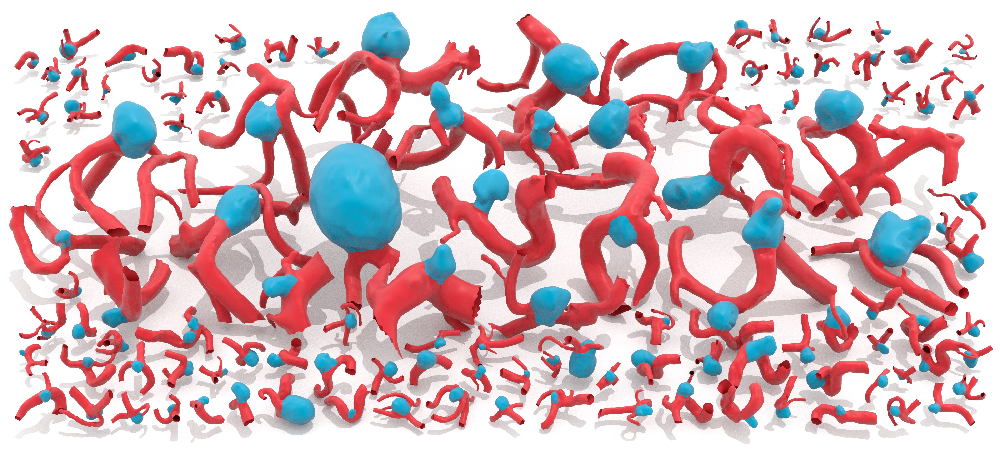
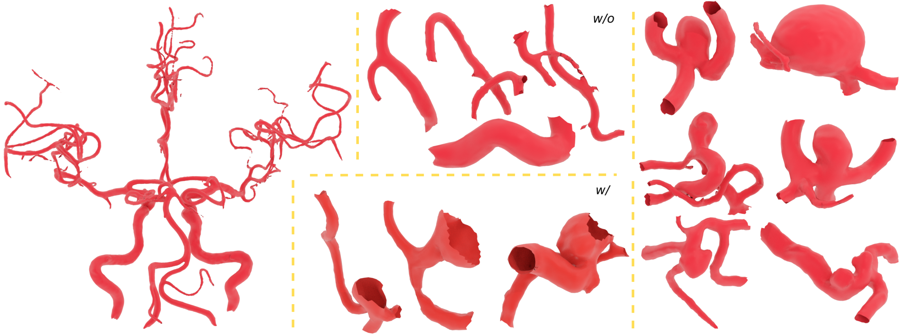

# News

> 2020.04.06 [Paper](https://arxiv.org/abs/2003.02920) is updated, and [Supplementary material](paper/supp.pdf  " ") is uploaded.

> 2020.03.02 Paper is uploaded to [arXiv](https://arxiv.org/abs/2003.02920).


# IntrA: 3D Intracranial Aneurysm Dataset for Deep Learning



Instead of 2D medical images, we introduce an open-access 3D intracranial aneurysm dataset, IntrA, that makes the application of points-based and mesh-based classification and segmentation models available. Our dataset can be used to diagnose intracranial aneurysms and to extract the neck for a clipping operation in medicine and other areas of deep learning, such as normal estimation and surface reconstruction. 

The dataset could be download [here](https://drive.google.com/drive/folders/1yjLdofRRqyklgwFOC0K4r7ee1LPKstPh?usp=sharing).

We are grateful for adding your information on this [form](https://forms.gle/rvMRsQ8t8Z6J8rdq8), if you think this dataset is useful.
Thank you!

## Data



103 3D models of entire brain vessels are collected by reconstructing scanned 2D MRA images of patients. We do not publish the raw 2D MRA images because of medical ethics. 

1909 blood vessel segments are generated automatically from the complete models, including 1694 healthy vessel segments and 215 aneurysm segments for diagnosis. 

116 aneurysm segments are divided and annotated manually by medical experts; the scale of each aneurysm segment is based on the need for a preoperative examination. 

Geodesic distance matrices are computed and included for each annotated 3D segment, because the expression of the geodesic distance is more accurate than Euclidean distance according to the shape of vessels. 

## Tools

### Annotation


```
annotation/main.py
```

Add button: adding a boundary line.

Left mouse button: selecting the points of a boundary line.

Middle mouse button: selecting a start point.

### Vessel segment generation

```
random_pick.py
selection.py
```

### Visualization

```
show_ann_data.py
show_result.py
```

## Benchmark

### Classification


### Segmentation


### Acknowledgements

This research was supported by AMED under Grant Number JP18he1602001.

### Paper

Please cite our paper if you use it.

```
@InProceedings{yang2020intra,
  author = {Yang, Xi and Xia, Ding and Kin, Taichi and Igarashi, Takeo},
  title = {IntrA: 3D Intracranial Aneurysm Dataset for Deep Learning},
  booktitle = {The IEEE Conference on Computer Vision and Pattern Recognition (CVPR)},
  year = {2020}
}
```
